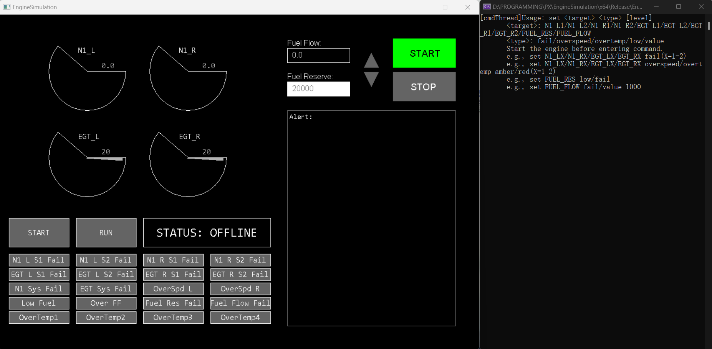
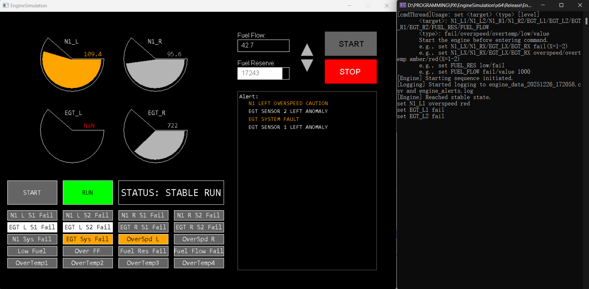

# EngineSimulation(EICAS)
### 期末大作业 
#### 2452443 龙羿

### 一、项目简介
本项目基于EasyX图形库，使用C++语言开发了一个简易的飞机发动机模拟仪表(EICAS)界面。该界面能够实时显示发动机的关键参数，如转速、温度和燃油流量等，帮助用户了解发动机的运行状态。

### 二、功能特点
**1. 实时数据更新**：
   - 界面能够动态显示发动机参数的变化，模拟真实的飞行环境。
  
**2. 图形化显示**：
   - 采用图表和指针仪表的形式展示数据，对于异常数据有不同颜色显示，。
   - 对于发动机不同故障状态，界面会有不同的视觉提示，包括不同颜色的警示灯，警告信息等。
  

    
**3. 用户交互**：
   - 用户可以通过按键操作来启动或关停发动机，模拟不同的飞行状态。也可以利用鼠标点击界面上的按钮增加或减少推力
   - 用户可以利用右侧终端的指令，模拟各种故障状态，如发动机过热、转速过快，燃油不足或流量过大。传感器故障等。也可以通过指令恢复正常状态。
    
**4. 数据记录**：
   - 系统每5ms记录一次发动机参数，并保存到本地文件，便于后续分析和调试。对于所有出现的警告，会记录到单独的日志文件中。
  
### 三、使用方法
**1. 环境配置**：
   - 确保系统已安装EasyX图形库，并配置好C++环境。
   - 将项目代码克隆到本地计算机。
   - 编译并运行项目。

**2. 操作步骤**：
   - 运行程序后，主界面将显示发动机参数和控制按钮。
   - 点击“START”按钮（绿色高亮的按钮，不是指示灯）
   - 进入稳定时，使用鼠标点击界面上的上下三角形按钮来调整发动机推力。
   - 在右侧终端输入指令模拟故障状态或恢复正常状态。
   - 按“STOP”按钮可以随时关闭发动机模拟。
   - 在项目目录下查看生成的参数记录文件和日志文件。
   - **只要点击了START就可以输入指令所以也可以模拟START状态的故障**